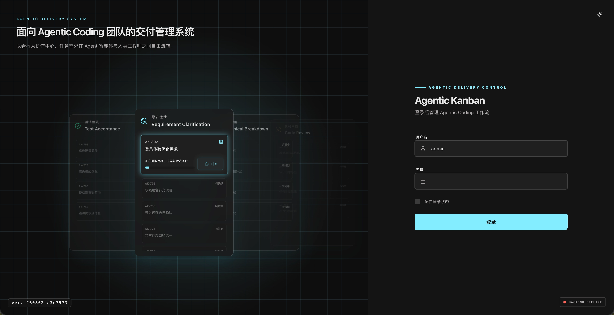

# AgenticKanban

AgenticKanban 是面向 Agentic Coding 团队的交付管理系统。它以看板为协作中心，将需求澄清、技术拆解、代码实现、代码审核、测试验收和归档串成可追踪的工作流，让人工决策与 Agent 执行在同一张任务卡中协作。

## 核心概念

每个项目拥有独立看板，任务沿固定阶段流转：需求澄清、技术拆解、代码实现、代码审核、测试验收、归档。人工在关键关口确认任务是否可交由 Agent 处理，Agent 的执行结果、审核意见、关联 Commit 和测试结果均可追溯。

详见：[核心设计](docs/核心设计.md)

## 特点

- 以任务卡串联人工确认与 Agent 执行，保留完整交付上下文
- 按阶段管理 Agent 可执行状态、人工审核和测试验收
- 关联 Git 仓库 Webhook 与 Commit，保证代码产出可追踪
- 支持独立 Agent 密钥，记录每次自动化执行的来源
- 内置纯前端 demo，可直接体验基础看板、任务和交付物页面

## 在线 Demo

https://jessetzh.github.io/AgenticKanban/

Demo 使用内置数据，登录页可输入任意用户名和密码进入。演示环境中的写入操作不会持久化。

## 界面预览

## 文档目录

- [核心设计](docs/核心设计.md)
- [技术架构](docs/技术架构.md)
- [使用与部署](docs/使用与部署.md)
